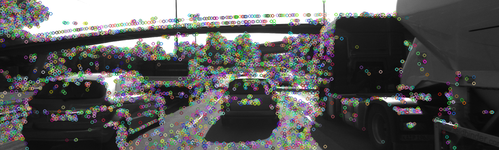
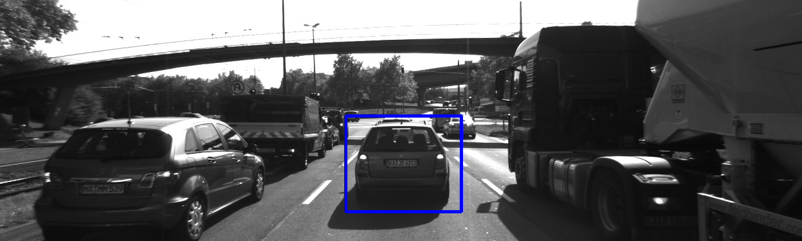
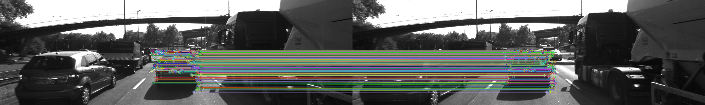

# SFND 2D Feature Tracking

The idea of the camera course is to build a collision detection system - that's the overall goal for the Final Project. As a preparation for this, you will now build the feature tracking part and test various detector / descriptor combinations to see which ones perform best. This mid-term project consists of four parts:

* First, you will focus on loading images, setting up data structures and putting everything into a ring buffer to optimize memory load. 
* Then, you will integrate several keypoint detectors such as HARRIS, FAST, BRISK and SIFT and compare them with regard to number of keypoints and speed. 
* In the next part, you will then focus on descriptor extraction and matching using brute force and also the FLANN approach we discussed in the previous lesson. 
* In the last part, once the code framework is complete, you will test the various algorithms in different combinations and compare them with regard to some performance measures. 
-----
# Reflection Based on Suggested [Rubic Points](https://review.udacity.com/#!/rubrics/2549/view)

## MP.1 Data Buffer Optimization
In order to efficiently working with large Dataset, It's Preffered to optimize usage of memory , so in this part we limit the loading procedure of image data in memory to keep the latest two images in sequence using constrained Vector. 

the implementation of this part can be found in "MidTermProject_Camera_Student.cpp". Lines 82-85.

*Source: Udacity Sensor Fusion ND*

## MP.2 Keypoint Detection
In this Part a set of different KeyPoints detector is implemented and tested against profided Dataset as follows:
* HARRIS
* SHI-TOMASI
* FAST
* BRISK
* ORB
* AKAZE
* SIFT

Each of these detector can be selected by assigning the proper string keyword to the variable "detectorType" found in "MidTermProject_Camera_Student.cpp". Line 46.

*Generated Keypoints using FAST Detector*

## MP.3 Keypoint Removal

For this Spacific project, it's was recommend to focus only on the precedding vehicle for analysis of different algorithms.
this was done by implemening a Rejection filter focus on the ROI and controlled by the flag "bFocusOnVehicle".
thi filter is implmented in "MidTermProject_Camera_Student.cpp". Lines 125 - 135. 

*Region of Interest filter*

## MP.4 Keypoint Descriptors
In this Part a set of different KeyPoints detector is implemented and tested against profided Dataset as follows:
* BRISK
* BRIEF
* ORB
* FREAK
* AKAZE 
* SIFT 

Each of these detector can be selected by assigning the proper string keyword to the variable "descriptorType" found in "MidTermProject_Camera_Student.cpp". Lines 47.
## MP.5-6 Descriptor Matching && Descriptor Distance Ratio

Both Brute Force Matcher and Flann Matcher are implemented and selectable using associated variable "matcherType". 

Selection of Best Matches is done using both NN and KNN 
for the KNN , Descriptor Distance Ratio test is implemented to decide the best match.

*Matched Keypoints using BFmatcher and KNN for Fast/BRIEF pair*

## MP.7 Performance Evaluation 1

the following table shows Statistics of The Avg. number of detecting keypoints in images and on the preceding vehicle for all 10 images and the distribution of their neighborhood size

|  Detector  | Average  Number of Detected KeyPoints | Number of Keypoints in ROI | The KeyPoints Neighborhood Dist. Mean   | The KeyPoints Neighborhood Dist. std |
|:----------:|:-------------------------------------:|:--------------------------:|:------------------------------------------:|:------------------------------------:|
| HARRIS     |                  173                  |             24             |                      6                     |                   0                  |
| SHI-TOMASI |                  1342                 |             117            |                      4                     |                   0                  |
| FAST       |                  4920                 |             409            |                      7                     |                   0                  |
| ORB        |                  500                  |             116            |                    55.14                   |                 44.48                |
| BRISK      |                  2711                 |             276            |                    21.8                    |                 26.01                |
| AKAZE      |                  1342                 |             167            |                    7.68                    |                 5.98                 |
| SIFT       |                  1385                 |             138            |                     5.4                    |                 11.54                |
## MP.8 Performance Evaluation 2

The following table shows the average number of matches for each combination of feature detector and descriptor.
| Average Matches for Detector / Descriptor Pair | BRISK | BRIEF | ORB | FREAK | AKAZE | SIFT |
|----------------------------------------------------|-------|-------|-----|-------|-------|------|
| HARRIS                                             | 15    | 19    | 17  | 16    | N/A   | 18   |
| SHI-TOMASI                                         | 85    | 104   | 100 | 85    | N/A   | 103  |
| FAST                                               | 242   | 314   | 306 | 247   | N/A   | 309  |
| ORB                                                | 83    | 60    | 84  | 46    | N/A   | 84   |
| BRISK                                              | 174   | 189   | 167 | 169   | N/A   | 182  |
| AKAZE                                              | 135   | 140   | 131 | 132   | 139   | 141  |
| SIFT                                               | 65    | 78    | N/A | 66    | N/A   | 88   |
## MP.9 Performance Evaluation 3
The following table shows average run time different detectors and for each combination of desriptor for agiven detector.

*Note*: This runtime is measured for filtered keypoints inside ROI. 
| Average RunTime for  Descriptor (ms) 	| BRISK 	| BRIEF 	| ORB   	| FREAK 	| AKAZE 	| SIFT  	| Average RunTime of Dectector (ms) 	|
|-----------------------------------------	|-------	|-------	|-------	|-------	|-------	|-------	|-----------------------------------	|
| HARRIS                                  	| 0.866 	| 0.7   	| 3.43  	| 30.65 	| N/A   	| 14.23 	| 12.3728                           	|
| SHI-TOMASI                              	| 1.71  	| 1     	| 3.55  	| 31.12 	| N/A   	| 14.2  	| 11.16                             	|
| FAST                                    	| 3.92  	| 1.455 	| 3.86  	| 32.7  	| N/A   	| 21.64 	| 1.7                               	|
| ORB                                     	| 1.27  	| 0.59  	| 11.27 	| 31.1  	| N/A   	| 30    	| 10.3                              	|
| BRISK                                   	| 2.73  	| 1.03  	| 10.84 	| 32.07 	| N/A   	| 25.84 	| 31.5                              	|
| AKAZE                                   	| 1.68  	| 0.71  	| 7.82  	| 31.1  	| 36.98 	| 16.92 	| 41.9                              	|
| SIFT                                    	| 1.44  	| 0.62  	| N/A   	| 31.05 	| N/A   	| 59.42 	| 89.52                             	|

## Conclusion
Based on the performance evaluation , the best combinations of Detector / Descriptors are:
1. FAST - BRIEF
2. FAST - ORB
3. FAST - BRISK
---
## Dependencies for Running Locally
* cmake >= 2.8
  * All OSes: [click here for installation instructions](https://cmake.org/install/)
* make >= 4.1 (Linux, Mac), 3.81 (Windows)
  * Linux: make is installed by default on most Linux distros
  * Mac: [install Xcode command line tools to get make](https://developer.apple.com/xcode/features/)
  * Windows: [Click here for installation instructions](http://gnuwin32.sourceforge.net/packages/make.htm)
* OpenCV >= 4.1
  * This must be compiled from source using the `-D OPENCV_ENABLE_NONFREE=ON` cmake flag for testing the SIFT and SURF detectors.
  * The OpenCV 4.1.0 source code can be found [here](https://github.com/opencv/opencv/tree/4.1.0)
* gcc/g++ >= 5.4
  * Linux: gcc / g++ is installed by default on most Linux distros
  * Mac: same deal as make - [install Xcode command line tools](https://developer.apple.com/xcode/features/)
  * Windows: recommend using [MinGW](http://www.mingw.org/)

## Basic Build Instructions

1. Clone this repo.
2. Make a build directory in the top level directory: `mkdir build && cd build`
3. Compile: `cmake .. && make`
4. Run it: `./2D_feature_tracking`.